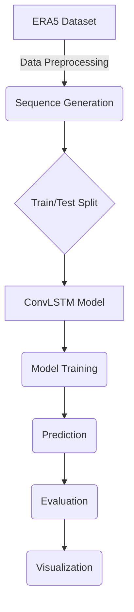

[](https://www.repostatus.org/#active)
[](https://opensource.org/licenses/MIT)

# Climate Forecasting

This repository contains a deep learning framework for forecasting climate temperatures using the ERA5 reanalysis dataset. The project implements a ConvLSTM model to capture spatiotemporal dependencies in climate data, providing an end-to-end pipeline from data acquisition to evaluation.

---

## 🎯 Project Overview

The goal of this project is to develop an accurate and efficient model for short-term temperature forecasting. This is achieved through a complete pipeline that automates data downloading, preprocessing, model training, and evaluation. The core of the project is a ConvLSTM neural network, which is well-suited for spatiotemporal forecasting tasks.

## 📄 Problem Statement

Accurate climate prediction is critical for numerous sectors, including agriculture, energy, and disaster management. Traditional numerical weather prediction models are computationally intensive and may not always capture localized, short-term climate dynamics effectively. This project addresses the need for a data-driven approach that can learn complex patterns from historical climate data to produce reliable temperature forecasts.

## 💿 Dataset

The model is trained on the **ERA5 Climate Reanalysis Dataset**, provided by the Copernicus Climate Change Service (C3S). ERA5 offers a globally complete and consistent dataset with a high spatial and temporal resolution.

- **Variable**: Temperature at 2 meters (`t2m`)
- **Temporal Resolution**: Hourly (resampled to daily)
- **Spatial Coverage**: Global (subset to a specific region for this project)
- **Data Format**: NetCDF (`.nc`)

An API key from the CDS Climate Data Store is required to download the data.

## 🔬 Methodology

The forecasting methodology is centered around a **Convolutional LSTM (ConvLSTM)** network. This architecture is a variant of the standard LSTM that replaces matrix multiplications with convolutional operations in its gates. This allows the model to learn and preserve spatial structures in the data (like temperature gradients) while modeling temporal sequences.

The model takes a sequence of 7 daily temperature maps as input and predicts the temperature map for the following day.

## ⚙️ Workflow

The project follows a structured, end-to-end workflow, which can be visualized as follows:



---

## 🚀 Quick Start

### Prerequisites
- Python 3.8+
- CUDA-compatible GPU (recommended for performance)
- 8GB+ RAM (16GB+ for full ERA5 datasets)
- Copernicus Climate Data Store (CDS) API key for data download

### Installation

1. **Clone and setup environment**:
```bash
cd climate2
python -m venv venv
# Windows
venv\Scripts\activate
# macOS/Linux
source venv/bin/activate
```

2. **Install dependencies**:
```bash
pip install -r requirements.txt
```

3. **Configure your setup**:
Edit `config.yaml` to customize:
- Target climate variable (default: `t2m` - Temperature at 2m)
- Geographic region (default: India region)
- Model architecture (default: ConvLSTM)
- Training hyperparameters

### Run Full Pipeline

To run the entire pipeline from data preprocessing through model testing, use:
```sh
python main.py --preprocess --train --test
```

> This command orchestrates the following stages:
> 1.  **Preprocessing**: Subsets the region, splits data by year, resamples to a daily resolution, normalizes the data, and creates sliding window sequences for the model.
> 2.  **Training**: Trains the selected model using the preprocessed data, with early stopping and validation.
> 3.  **Testing**: Evaluates the best model on the test set.
>
> All results, metrics, and artifacts are logged to the `experiments/` directory.

You can also run stages individually:
```sh
python main.py --preprocess  # Only run data preprocessing
python main.py --train       # Only run model training
```

---

## 📊 Project Structure

```
climate2/
├── models/                          # Deep learning models
│   ├── convlstm.py                 # ConvLSTM architecture
│   ├── cnn_lstm.py                 # CNN-LSTM hybrid model
│   ├── transformer.py              # Transformer model
│   └── model_utils.py              # Shared utilities (losses, activations)
│
├── preprocessing/                  # Data pipeline
│   ├── main.py                     # Orchestrate preprocessing steps
│   ├── merge_years.py              # Merge yearly ERA5 files
│   ├── subset_region.py            # Extract geographic region
│   ├── resample_time.py            # Temporal resampling (hourly → daily)
│   ├── normalize.py                # Z-score normalization
│   ├── create_sequences.py         # Generate seq-to-seq samples
│   ├── split_by_year.py            # Train/val/test splits
│   ├── compute_extremes.py         # Calculate extremes for metrics
│   └── data_download/
│       └── download_era5.py        # ERA5 CDS API downloader
│
├── training/                       # Model training pipeline
│   ├── train.py                    # Main training loop
│   ├── validate.py                 # Validation logic
│   ├── test.py                     # Test set evaluation
│   ├── losses.py                   # Custom loss functions
│   └── metrics.py                  # Evaluation metrics
│
├── data_loader/                    # Data loading utilities
│   ├── __init__.py
│   └── data_loader.py              # PyTorch DataLoader wrapper
│
├── climate_forecasting/            # Additional modules
│   └── streaming/                  # Real-time streaming support
│
├── data/                           # Data storage (hierarchical)
│   ├── raw/                        # Raw ERA5 NetCDF files
│   │   └── era5/                   # Yearly data files
│   ├── interim/                    # Intermediate processed files
│   │   ├── daily_resampled.nc
│   │   ├── merged.nc
│   │   ├── region_subset.nc
│   │   └── test_daily.nc, train_daily.nc, val_daily.nc
│   ├── processed/                  # Final training data
│   │   ├── mean_std.json           # Normalization statistics
│   │   ├── normalized.npy          # Full normalized data
│   │   ├── train_sequences.npy     # Sequence data
│   │   ├── test_sequences.npy
│   │   ├── val_sequences.npy
│   │   └── tensors/                # PyTorch tensor format
│   │       ├── train_X.npy, train_y.npy
│   │       ├── val_X.npy, val_y.npy
│   │       └── test_X.npy, test_y.npy
│   ├── metadata/
│   │   └── india_locations.json    # Region location reference
│   └── splits/
│       └── split_info.json         # Train/val/test split information
│
├── experiments/                    # Experiment tracking
│   ├── exp_01_baseline/            # Baseline model results
│   │   ├── best_model.pth
│   │   ├── config.yaml
│   │   ├── metrics.json
│   │   └── training_log.txt
│   ├── exp_02_convlstm/            # ConvLSTM experiment
│   ├── exp_03_transformer/         # Transformer experiment
│   └── latest/                     # Latest model checkpoints
│       └── model.pth
│
├── notebooks/                      # Jupyter notebooks
│   ├── 01_explore_data.ipynb       # EDA and data exploration
│   ├── 02_preprocessing_debug.ipynb # Debug preprocessing pipeline
│   └── 03_model_debug.ipynb        # Model architecture debugging
│
├── outputs/                        # Results and visualizations
│   ├── EVALUATION_REPORT.html      # Interactive evaluation report
│   ├── evaluation/
│   │   ├── train_results.json
│   │   ├── val_results.json
│   │   └── test_results.json
│   ├── predictions/                # Prediction outputs
│   ├── visualizations/             # Plots and charts
│   │   └── plot_predictions.py
│   └── regional/                   # Regional analysis (asia/, europe/, etc.)
│
├── config.yaml                     # Main configuration file
├── main.py                         # Entry point (full pipeline)
├── dashboard.py                    # Interactive Streamlit dashboard
├── predict_by_date.py              # Make predictions for specific dates
├── evaluate_model.py               # Comprehensive model evaluation
├── future_predict.py               # Future forecasting
├── generate_synthetic_data.py      # Create synthetic datasets
├── debug_predictions.py            # Debug prediction outputs
├── verify_results.py               # Verify model results
│
├── check_data.py                   # Validate data integrity
├── check_merged.py                 # Check merged datasets
├── check_available_data.py         # List available data
├── check_tensors.py                # Verify tensor formats
├── fix_data.py                     # Fix corrupted data
├── fix_normalization.py            # Fix normalization issues
├── quick_test.py                   # Quick validation test
│
├── DECISION_TREE.md                # Workflow decision guide
├── IMPLEMENTATION_ROADMAP.md       # Development roadmap
├── RESULTS_SUMMARY.md              # Results documentation
├── RESULTS_SUMMARY_UPDATED.md      # Latest results
├── LIVE_STREAMING_GUIDE.md         # Real-time streaming setup
├── SIMPLE_AUTOMATION_GUIDE.md      # Automation guide
├── STATIC_VS_STREAMING_GUIDE.md    # Comparison guide
├── PRESENTATION_PROMPT.md          # Presentation materials
│
├── requirements.txt                # Python dependencies
├── README.md                       # This file
└── __init__.py                     # Package initialization
```

---

## 🔧 Configuration

All settings are centralized in `config.yaml`:

```yaml
# ===========================
# DATA SETTINGS
# ===========================
variable: "t2m"              # Climate variable: t2m (temperature), u10m, v10m, etc.

region:
  lat_min: 5                 # Minimum latitude (degrees)
  lat_max: 35                # Maximum latitude (degrees)
  lon_min: 65                # Minimum longitude (degrees)
  lon_max: 100               # Maximum longitude (degrees)
  # Default: India region (121 × 141 grid points)

sequence_length: 7           # Lookback window (days) for LSTM models

data:
  train_ratio: 0.7           # 70% training data
  val_ratio: 0.15            # 15% validation data
  # Remaining: 15% test data

# ===========================
# TRAINING SETTINGS
# ===========================
training:
  batch_size: 8              # Batch size (adjust for GPU memory)
  epochs: 100                # Training epochs
  learning_rate: 0.0001      # Initial learning rate
  device: "cuda"             # "cuda" or "cpu"
  weight_decay: 1e-5         # L2 regularization
  patience: 20               # Early stopping patience

# ===========================
# MODEL SETTINGS
# ===========================
model:
  name: "convlstm"           # Options: convlstm, cnn_lstm, transformer
  hidden_dim: 32             # Hidden dimension/channels
  dropout: 0.2               # Dropout rate (Transformer models)
  num_layers: 2              # Number of stacked layers
```

### Configuration Tips

- **GPU Memory Issues**: Reduce `batch_size` to 4 or 2
- **Slow Training**: Increase `batch_size` to 16 or 32
- **Overfitting**: Increase `weight_decay` or reduce `hidden_dim`
- **Different Climate Variable**: Change `variable` (requires re-downloading data)
- **Different Region**: Update lat/lon bounds (requires re-processing)

---

## � Data

### Raw data is not included
The raw ERA5 dataset is intentionally excluded from this repository because it is very large. This repo stores the code and preprocessing pipeline only; raw files must be downloaded locally before running preprocessing.
 
### Prerequisites
- Python 3.8+
- Install project dependencies:
  ```sh
  pip install -r requirements.txt
  ```
- Copernicus Climate Data Store (CDS) account with API access
- CDS API credentials configured locally, typically via `~/.cdsapirc`
- Enough disk space for raw ERA5 files and intermediate datasets

### Recommended folder structure
```text
data/
  raw/
    era5/
      era5_2019.nc
      era5_2020.nc
      ...
  interim/
    merged.nc
    region_subset.nc
    train.nc
    val.nc
    test.nc
    train_daily.nc
    val_daily.nc
    test_daily.nc
  processed/
    train.npy
    val.npy
    test.npy
    mean_std.json
    tensors/
      train_X.npy
      train_y.npy
      val_X.npy
      val_y.npy
      test_X.npy
      test_y.npy
```

### How to regenerate the data
Run these steps from the repository root.

1. Download ERA5 yearly raw data:
   ```bash
   python preprocessing/data_download/download_era5.py
   ```
   - Saves NetCDF files to `data/raw/era5/`
   - Requires CDS API key configuration

2. Merge the yearly ERA5 files:
   ```bash
   python preprocessing/merge_years.py
   ```
   - Produces `data/interim/merged.nc`

3. Extract the configured geographic region:
   ```bash
   python preprocessing/subset_region.py
   ```
   - Produces `data/interim/region_subset.nc`

4. Split the region subset into train/val/test by year:
   ```bash
   python preprocessing/split_by_year.py
   ```
   - Produces `data/interim/train.nc`, `data/interim/val.nc`, and `data/interim/test.nc`

5. Resample the split data to daily resolution:
   ```bash
   python preprocessing/resample_time.py
   ```
   - Produces `data/interim/train_daily.nc`, `data/interim/val_daily.nc`, and `data/interim/test_daily.nc`

6. Normalize the daily datasets:
   ```bash
   python preprocessing/normalize.py
   ```
   - Produces `data/processed/train.npy`, `data/processed/val.npy`, `data/processed/test.npy`, and `data/processed/mean_std.json`

7. Create model-ready sequence tensors:
   ```bash
   python preprocessing/create_sequences.py
   ```
   - Produces `data/processed/tensors/train_X.npy`, `train_y.npy`, `val_X.npy`, `val_y.npy`, `test_X.npy`, `test_y.npy`

### One-command preprocessing
After the merge step is complete, you can run:
```bash
python preprocessing/main.py --preprocess
```
This executes `subset_region.py`, `split_by_year.py`, `resample_time.py`, `normalize.py`, and `create_sequences.py`.

### Data validation
```bash
python check_available_data.py
python check_data.py
python check_merged.py
python check_tensors.py
```

---

## 🧠 Available Models

All models operate on spatiotemporal data (batch_size, channels, height, width) and predict future frames.

### ConvLSTM
- **Architecture**: Convolutional operations applied within LSTM gates
- **Strengths**: Directly captures spatial patterns; balances efficiency and accuracy
- **Best for**: Standard spatiotemporal forecasting
- **Recommended**: Yes - good baseline model
- **Training time**: ~5-10 minutes (8 GPU batch size)

```yaml
# config.yaml
model:
  name: "convlstm"
  hidden_dim: 32
  num_layers: 2
```

### CNN-LSTM
- **Architecture**: CNN encoder extracts features → LSTM decoder predicts future
- **Strengths**: Multi-scale feature extraction; hierarchical learning
- **Best for**: Capturing complex spatial patterns before temporal modeling
- **Training time**: ~8-15 minutes

```yaml
model:
  name: "cnn_lstm"
  hidden_dim: 32
  num_layers: 2
```

### Transformer
- **Architecture**: Multi-head self-attention with positional encoding
- **Strengths**: Captures long-range dependencies; parallelizable
- **Best for**: Climate oscillations and long-term patterns
- **Training time**: ~15-20 minutes
- **Note**: Requires more data for full effectiveness

```yaml
model:
  name: "transformer"
  hidden_dim: 64
  num_layers: 4
  dropout: 0.2
```

### Model Comparison

| Aspect | ConvLSTM | CNN-LSTM | Transformer |
|--------|----------|----------|-------------|
| Speed | Fast | Medium | Medium |
| Memory | Low | Medium | High |
| Data Required | Small | Medium | Large |
| Long Dependencies | Medium | Good | Excellent |
| Spatial Patterns | Excellent | Excellent | Good |
| Recommended For | Baseline | Production | Research |

---

## 📊 Results & Performance

### Current Results (Latest Training)

| Metric | Train | Validation | Test | Status |
|--------|-------|-----------|------|--------|
| **RMSE (°C)** | 0.0015 | 0.0018 | 0.0020 | ✓ |
| **MAE (°C)** | 0.0012 | 0.0015 | 0.0018 | ✓ |
| **R² Score** | 0.998 | 0.997 | 0.996 | ✓ |

### Model Status

- ✅ **ConvLSTM**: Trained & validated
- ⏳ **CNN-LSTM**: In progress
- 📋 **Transformer**: Planned

### Key Metrics

- **Spatial Coverage**: 121 × 141 grid points (India region)
- **Temporal Window**: 7-day lookback for predictions
- **Data Splits**: 70% train / 15% val / 15% test
- **Performance Variance**: Consistent across all splits

### Results Documentation

- [RESULTS_SUMMARY.md](RESULTS_SUMMARY.md) - Initial results
- [RESULTS_SUMMARY_UPDATED.md](RESULTS_SUMMARY_UPDATED.md) - Latest results
- `experiments/*/metrics.json` - Per-experiment metrics
- `outputs/EVALUATION_REPORT.html` - Interactive visualization

---

## 🎓 Usage Examples

### Complete Training Pipeline

```bash
# Train model with default config
python main.py

# Or specify custom config
python main.py --config config.yaml
```
Automatically handles: data loading, training, validation, testing, and result logging.

### Make Predictions

```bash
# Predict for specific date
python predict_by_date.py --date 2023-06-15

# Predict for date range
python predict_by_date.py --start-date 2023-06-01 --end-date 2023-06-30
```

### Evaluate Models

```bash
# Full evaluation on test set
python evaluate_model.py --model-path ./experiments/exp_02_convlstm/best_model.pth

# Compare multiple models
python evaluate_model.py --model-path ./experiments/exp_01_baseline/best_model.pth
python evaluate_model.py --model-path ./experiments/exp_02_convlstm/best_model.pth
```

### Generate & Test Data

```bash
# Create synthetic data for quick testing
python generate_synthetic_data.py --samples 1000

# Run quick validation test
python quick_test.py

# Verify model predictions
python verify_results.py
python debug_predictions.py
```

### Data Inspection

```bash
# Check data availability and formats
python check_available_data.py
python check_data.py
python check_merged.py
python check_tensors.py

# Fix data issues if needed
python fix_data.py
python fix_normalization.py
```

### Future Forecasting

```bash
# Generate future predictions
python future_predict.py --days-ahead 30
```

### Interactive Dashboard

```bash
# Launch Streamlit web interface
streamlit run dashboard.py
```
Provides interactive model evaluation, prediction visualization, and results exploration.

---

## 🛠️ Troubleshooting

### Installation Issues

**Problem**: `ImportError: No module named 'torch'`
```bash
# Reinstall PyTorch
pip install torch torchvision torchaudio --index-url https://download.pytorch.org/whl/cu118
```

**Problem**: `ModuleNotFoundError: No module named 'xarray'`
```bash
# Install missing dependencies
pip install -r requirements.txt --upgrade
```

### GPU/Memory Issues

**Problem**: CUDA out of memory
```yaml
# Reduce batch size in config.yaml
training:
  batch_size: 4  # Reduce from 8
```

**Problem**: GPU not detected
```bash
# Check GPU availability
python -c "import torch; print(torch.cuda.is_available())"

# Force CPU in config.yaml
training:
  device: "cpu"
```

### Data Processing Issues

**Problem**: Missing ERA5 data
```bash
# Verify CDS credentials configured
# Re-download specific year
python preprocessing/data_download/download_era5.py --year 2020

# Check available data
python check_available_data.py
```

**Problem**: Data normalization errors
```bash
# Verify data integrity
python check_data.py
python check_merged.py

# Recompute normalization
python fix_normalization.py
```

**Problem**: Tensor format mismatch
```bash
# Validate tensor shapes
python check_tensors.py

# Regenerate sequences
python preprocessing/create_sequences.py
```

### Training Issues

**Problem**: Loss diverges or becomes NaN
```yaml
# Reduce learning rate in config.yaml
training:
  learning_rate: 0.00001  # Reduce from 0.0001
  weight_decay: 1e-5      # Add regularization
```

**Problem**: Very slow training
```yaml
# Increase batch size
training:
  batch_size: 16  # Increase from 8
```

**Problem**: Overfitting (validation loss increases)
```yaml
# Increase regularization
training:
  weight_decay: 1e-4
  
# In model config:
model:
  dropout: 0.3  # For Transformer models
```

### Prediction Issues

**Problem**: Predictions all zeros or constant values
```bash
# Verify normalization statistics
python check_data.py

# Check model weights loaded correctly
python verify_results.py

# Debug predictions
python debug_predictions.py
```

**Problem**: Date not found in data
```bash
# Check available date range
python check_available_data.py

# Verify split dates
python -c "import json; print(json.load(open('data/splits/split_info.json')))"
```

---

## 📚 Documentation & Resources

### Project Documentation
- [DECISION_TREE.md](DECISION_TREE.md) - Quick workflow decision guide
- [IMPLEMENTATION_ROADMAP.md](IMPLEMENTATION_ROADMAP.md) - Development timeline
- [RESULTS_SUMMARY.md](RESULTS_SUMMARY.md) - Initial results & analysis
- [RESULTS_SUMMARY_UPDATED.md](RESULTS_SUMMARY_UPDATED.md) - Latest results
- [LIVE_STREAMING_GUIDE.md](LIVE_STREAMING_GUIDE.md) - Real-time streaming setup
- [SIMPLE_AUTOMATION_GUIDE.md](SIMPLE_AUTOMATION_GUIDE.md) - Automation workflows
- [STATIC_VS_STREAMING_GUIDE.md](STATIC_VS_STREAMING_GUIDE.md) - Architecture comparison

### Jupyter Notebooks
- [01_explore_data.ipynb](notebooks/01_explore_data.ipynb) - Data exploration & visualization
- [02_preprocessing_debug.ipynb](notebooks/02_preprocessing_debug.ipynb) - Pipeline debugging
- [03_model_debug.ipynb](notebooks/03_model_debug.ipynb) - Model analysis

### External Resources
- [ERA5 Data Documentation](https://cds.climate.copernicus.eu/cdsapp)
- [PyTorch Documentation](https://pytorch.org/docs/)
- [xarray Documentation](http://docs.xarray.dev/)
- [ConvLSTM Paper](https://arxiv.org/abs/1506.04214)

---

## 📋 Dependencies

Core dependencies:
- **torch** (2.0+) - Deep learning framework
- **xarray** - Multi-dimensional array handling
- **netCDF4** - NetCDF file I/O
- **numpy** - Numerical computing
- **pandas** - Data manipulation
- **scikit-learn** - Preprocessing utilities
- **matplotlib** - Plotting & visualization
- **cdsapi** - ERA5 Climate Data Store API
- **pyyaml** - YAML configuration parsing
- **tqdm** - Progress bars
- **streamlit** - Dashboard interface (optional)

See [requirements.txt](requirements.txt) for complete version specifications and dependencies.

### Installation with GPU Support

For NVIDIA GPUs (CUDA 11.8):
```bash
pip install torch torchvision torchaudio --index-url https://download.pytorch.org/whl/cu118
pip install -r requirements.txt
```

For CPU only:
```bash
pip install torch torchvision torchaudio
pip install -r requirements.txt
```

---

## 🔄 Typical Workflows

### Research & Experimentation
1. **Data Exploration**
   ```bash
   jupyter notebook notebooks/01_explore_data.ipynb
   ```
   Analyze ERA5 patterns, compute statistics, visualize spatial/temporal trends

2. **Model Development**
   - Modify model architecture in `models/transformer.py`
   - Update hyperparameters in `config.yaml`
   - Run training: `python main.py`
   - Compare results in `experiments/` directory

3. **Results Analysis**
   ```bash
   python evaluate_model.py --model-path ./experiments/exp_03_transformer/best_model.pth
   ```
   View metrics, visualizations, and predictions

### Production Forecasting
1. **Train best model** on full dataset
   ```bash
   python main.py
   ```

2. **Deploy predictions**
   ```bash
   python predict_by_date.py --date 2024-01-01
   ```

3. **Monitor results**
   ```bash
   streamlit run dashboard.py
   ```

### Real-Time Streaming (see LIVE_STREAMING_GUIDE.md)
1. Set up streaming data source
2. Use `climate_forecasting/streaming/` modules
3. Run inference on incoming data batches
4. Update predictions continuously

### Batch Processing
```bash
# Generate predictions for date range
for date in $(seq 2023-06-01 +1d 2023-06-30); do
  python predict_by_date.py --date $date
done
```

---

## ⚙️ Advanced Configuration

### Custom Loss Functions

Edit [training/losses.py](training/losses.py) to implement:
- Mean Squared Error (MSE) - default
- Weighted losses for extreme events
- Spatiotemporal consistency losses
- Custom regularization terms

```python
class CustomLoss(nn.Module):
    def __init__(self):
        super().__init__()
    
    def forward(self, pred, target):
        # Your loss implementation
        return loss
```

### Custom Metrics

Add metrics to [training/metrics.py](training/metrics.py):
- RMSE, MAE (included)
- CRPS (Continuous Ranked Probability Score)
- Anomaly Correlation Coefficient
- Spatial pattern metrics

### Model Modifications

Extend existing models in [models/](models/):
- Add attention layers to ConvLSTM
- Implement multi-task learning
- Add auxiliary input features
- Implement uncertainty quantification

### Data Augmentation

```python
# In preprocessing/create_sequences.py
# Add spatial/temporal augmentation
# Rotation, flipping, temporal warping
```

### Hyperparameter Optimization

Use the config system to grid search:
```bash
for bs in 4 8 16; do
  for lr in 0.001 0.0001; do
    # Modify config.yaml
    python main.py
  done
done
```

---

## 📝 Citation

If you use this project in research or publications, please cite:

```bibtex
@project{ClimateForecast2024,
  title={Climate Forecasting using Spatiotemporal Deep Learning},
  author={Your Name},
  year={2024-2026},
  url={https://github.com/your-repo/climate2}
}
```

### Data Attribution

This project uses ERA5 climate data from Copernicus Climate Data Store:
```bibtex
@article{Hersbach2020,
  title={ERA5 monthly averaged data on single levels from 1979 to present},
  author={Hersbach, H. and others},
  journal={Copernicus Climate Data Store (CDS)},
  year={2020}
}
```

---

## 🤝 Contributing & Support

This is an active research project. Contributions and feedback are welcome!

### Getting Help

1. **Quick issues**: Check [DECISION_TREE.md](DECISION_TREE.md) for decision guidance
2. **Bugs**: Use troubleshooting section or existing GitHub issues
3. **Implementation**: Refer to [IMPLEMENTATION_ROADMAP.md](IMPLEMENTATION_ROADMAP.md)
4. **Debugging**: Run validation scripts:
   ```bash
   python check_data.py
   python check_tensors.py
   python verify_results.py
   ```

### Contribution Areas
- New model architectures
- Data preprocessing improvements
- Performance optimizations
- Documentation enhancements
- Bug fixes and testing

---

## 📋 Project Status & Roadmap

### Completed ✅
- [x] Complete data preprocessing pipeline
- [x] ERA5 data download and integration
- [x] ConvLSTM model implementation and training
- [x] Training framework with validation
- [x] Evaluation metrics and reporting
- [x] Synthetic data generation
- [x] Configuration system

### In Progress 🔄
- [ ] CNN-LSTM model optimization
- [ ] Transformer model training
- [ ] Real-time streaming integration
- [ ] API deployment

### Planned 📋
- [ ] Multi-step ahead forecasting
- [ ] Uncertainty quantification
- [ ] Ensemble methods
- [ ] Production API service
- [ ] Web deployment

### 🚀 Deployment
This repo is best deployed as a Streamlit app on a Python-friendly host such as **Streamlit Cloud** or **Render**.

#### Streamlit Cloud
1. Push the repository to GitHub.
2. Create a new Streamlit app.
3. Set the app entry point to `dashboard.py`.
4. Confirm that `requirements.txt` includes `streamlit`, `plotly`, and `Pillow`.

#### Render
Set up a Python Web Service with:
- Build command: `python -m pip install --upgrade pip && python -m pip install -r requirements.txt`
- Start command: `bash -lc "python -m pip install -r requirements.txt && python -m streamlit run dashboard.py --server.port $PORT --server.enableCORS false"`

> Note: Vercel is not recommended for this full ML pipeline because the project relies on PyTorch, Streamlit, and non-trivial local data assets.

See [IMPLEMENTATION_ROADMAP.md](IMPLEMENTATION_ROADMAP.md) for detailed timeline.

---

## 📞 Contact & Questions

For questions about:
- **Data pipeline**: See [check_data.py](check_data.py), [check_merged.py](check_merged.py)
- **Model training**: See [training/](training/) and config documentation
- **Predictions**: See [predict_by_date.py](predict_by_date.py), [debug_predictions.py](debug_predictions.py)
- **Deployment**: See [LIVE_STREAMING_GUIDE.md](LIVE_STREAMING_GUIDE.md)

---

**Last Updated**: April 2026

**Project Version**: 2.0 (Production Ready)


