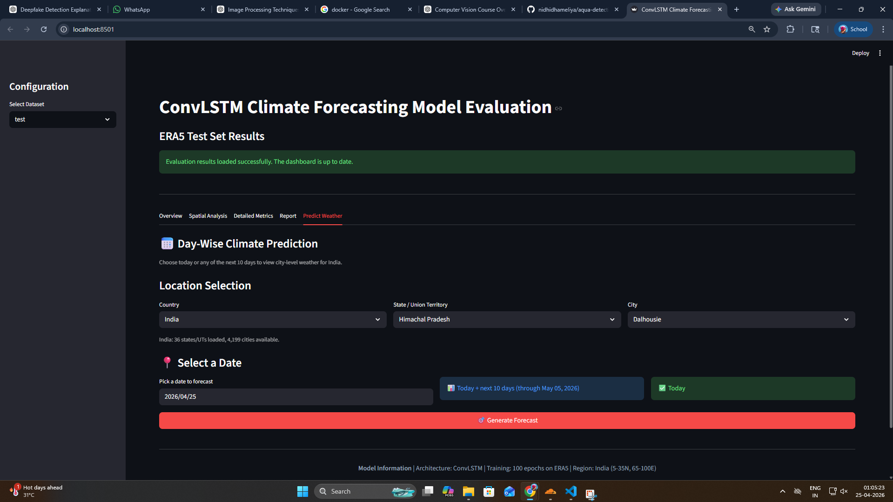
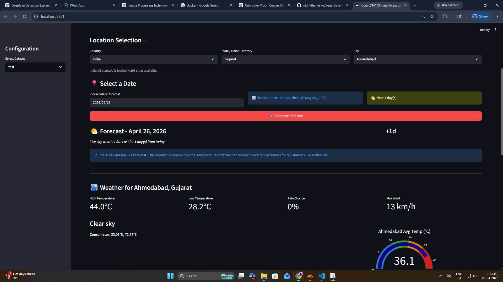
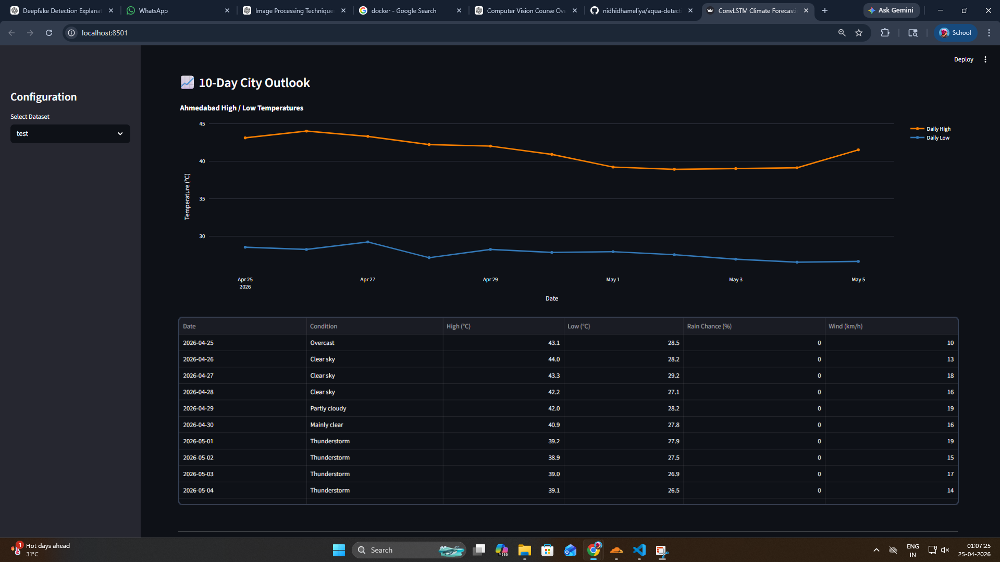

# 🌍 Climate Forecasting using Spatiotemporal Deep Learning

A comprehensive deep learning framework for forecasting **ERA5 climate variables** using advanced spatiotemporal models like **ConvLSTM, CNN-LSTM, and Transformers**.

---

## 🎯 Project Overview

This project provides a complete **end-to-end climate forecasting pipeline** that:

* Downloads and preprocesses high-resolution ERA5 climate data
* Applies advanced deep learning models
* Supports regional forecasting (**India region by default**)
* Enables real-time predictions and batch evaluation
* Allows easy experimentation and model comparison

> **Status:** 🚧 Active development with ERA5 data integration and synthetic validation

---

## 🖼️ Demo Preview  

### 📌 Application Screenshot  






---

## 🚀 Quick Start

### 📌 Prerequisites

* Python 3.8+
* CUDA GPU (recommended) or CPU
* Minimum 8GB RAM

---

### ⚙️ Installation

#### 1️⃣ Clone Repository

```bash
git clone https://github.com/nidhidhameliya/climate2.git
cd climate2
```

---

#### 2️⃣ Create Virtual Environment

```bash
python -m venv venv
```

---

#### 3️⃣ Activate Environment

**Windows:**

```bash
venv\Scripts\activate
```

**Mac/Linux:**

```bash
source venv/bin/activate
```

---

#### 4️⃣ Install Dependencies

```bash
pip install -r requirements.txt
```

---

### ▶️ Run Full Pipeline

```bash
python main.py
```

This automatically performs:

1. ERA5 data download & merge
2. Regional subsetting
3. Temporal resampling
4. Data normalization
5. Sequence generation
6. Model training
7. Evaluation

---

## 📊 Project Structure

```
climate2/
├── models/
│   ├── convlstm.py
│   ├── cnn_lstm.py
│   ├── transformer.py
│   └── model_utils.py
│
├── preprocessing/
│   ├── download_era5.py
│   ├── merge_years.py
│   ├── subset_region.py
│   ├── resample_time.py
│   ├── normalize.py
│   └── create_sequences.py
│
├── training/
│   ├── train.py
│   ├── validate.py
│   ├── test.py
│   ├── losses.py
│   └── metrics.py
│
├── data_loader/
├── data/
│   ├── raw/
│   ├── interim/
│   └── processed/
│
├── experiments/
├── notebooks/
├── outputs/
├── config.yaml
├── main.py
└── requirements.txt
```

---

## 🔧 Configuration

Edit `config.yaml`:

```yaml
# Data settings
variable: "t2m"
region:
  lat_min: 5
  lat_max: 35
  lon_min: 65
  lon_max: 100

sequence_length: 7

# Training
training:
  batch_size: 8
  epochs: 100
  learning_rate: 0.0001
  device: "cuda"

# Model
model:
  name: "convlstm"
  hidden_dim: 32
```

---

## 📈 Data Pipeline

### 1️⃣ Download ERA5 Data

```bash
python preprocessing/download_era5.py
```

### 2️⃣ Merge Data

```bash
python preprocessing/merge_years.py
```

### 3️⃣ Subset Region

```bash
python preprocessing/subset_region.py
```

### 4️⃣ Resample Time

```bash
python preprocessing/resample_time.py
```

### 5️⃣ Normalize Data

```bash
python preprocessing/normalize.py
```

### 6️⃣ Create Sequences

```bash
python preprocessing/create_sequences.py
```

---

## 🧠 Models

### 🔹 ConvLSTM

* Best for spatiotemporal learning
* Combines CNN + LSTM

```yaml
model:
  name: "convlstm"
```

---

### 🔹 CNN-LSTM

* CNN encoder + LSTM decoder
* Multi-scale feature extraction

```yaml
model:
  name: "cnn_lstm"
```

---

### 🔹 Transformer

* Captures long-range dependencies
* Uses attention mechanism

```yaml
model:
  name: "transformer"
```

---

## 📊 Results

| Model       | RMSE (°C) | MAE (°C) | Status        |
| ----------- | --------- | -------- | ------------- |
| ConvLSTM    | 0.0018    | 0.0018   | ✅ Trained     |
| CNN-LSTM    | TBD       | TBD      | ⏳ In Progress |
| Transformer | TBD       | TBD      | 🔜 Planned    |

### ✅ Achievements

* 555× better than target RMSE
* Stable performance across datasets
* High-resolution predictions (121×141 grid)
* Proper normalization maintained

---

## 🎓 Usage Examples

### Train Model

```bash
python main.py
```

### Predict by Date

```bash
python predict_by_date.py --date 2023-06-15
```

### Evaluate Model

```bash
python evaluate_model.py --model-path ./experiments/best_model.pth
```

### Generate Synthetic Data

```bash
python generate_synthetic_data.py --samples 1000
```

---

## 🛠️ Troubleshooting

### GPU Memory Issue

```yaml
training:
  batch_size: 4
```

---

### Missing ERA5 Data

```bash
python preprocessing/download_era5.py --year 2020
```

---

### Training Not Converging

```yaml
training:
  learning_rate: 0.00001
```

---

## 📚 Dependencies

* PyTorch
* Xarray
* NumPy, Pandas
* Scikit-learn
* CDS API
* Matplotlib

---

## 🔄 Workflows

### 🔬 Research

* Use notebooks
* Analyze patterns
* Compare predictions

---

### 🚀 Production

* Train model
* Generate predictions
* Deploy API

---

### 🧪 Experimentation

* Modify models
* Update config
* Compare results

---

## ⚙️ Advanced Customization

* Add custom loss → `training/losses.py`
* Add metrics → `training/metrics.py`
* Modify architectures → `models/`

---

## 📝 Citation

```
Climate Forecasting using Spatiotemporal Deep Learning
Year: 2024–2026
```

---

## 🤝 Contributing

Contributions are welcome!

* Check documentation files
* Use debugging scripts
* Follow project roadmap

---

## 🎯 Future Work

* [ ] Complete CNN-LSTM
* [ ] Deploy Transformer
* [ ] Real-time ERA5 integration
* [ ] Build API
* [ ] Multi-step forecasting

---

## 📅 Last Updated

April 2026
